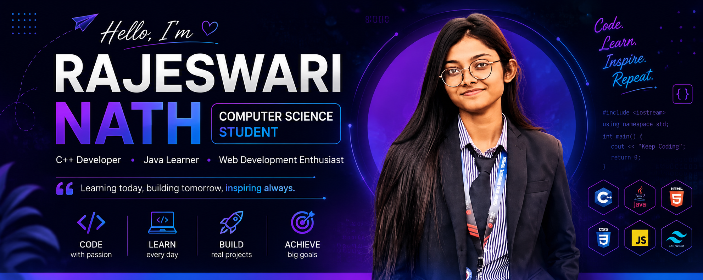

 

  

  

<h1 align="center">Hi 👋, I'm Rajeswari Nath</h1>

<h3 align="center">
Computer Science Student • Aspiring Software Developer • India 🇮🇳
</h3>

---

# 💫 About Me

💻 Computer Science Student

🌱 Currently learning Data Structures & Algorithms

🚀 Passionate about Software Development

💡 Interested in Full Stack Web Development

⚡ Love solving coding problems

🎯 Goal: Become a Software Engineer

---

# 🚀 Tech Stack

---

# 📊 GitHub Stats

---

# 🔥 GitHub Streak

---

# 📈 Contribution Graph

---

# 🏆 GitHub Trophies

---

# 🌐 Coding Profiles

---

# 📚 Currently Learning

- Data Structures & Algorithms
- C++ STL
- Java
- Python
- React.js
- Git & GitHub
- Full Stack Development

---

# 💼 Featured Projects

⭐ Student Grade Management System

⭐ Student Attendance System

⭐ DSA in C++

⭐ Java Programs

⭐ React Projects

⭐ Responsive Web Applications

---

# 📫 Connect With Me

📧 Email

**rajeswarinath12@gmail.com**

💼 LinkedIn

**https://www.linkedin.com/in/YOUR-LINKEDIN**

---

# 💭 Dev Quote

---

# ⭐ Support Me

If you like my work, consider giving a ⭐ to my repositories!

---

# 💡 Quote

> **"Success doesn't come from what you know. It comes from what you consistently build."**

---

### ⭐ Thanks for Visiting My Profile ⭐

 --> 
